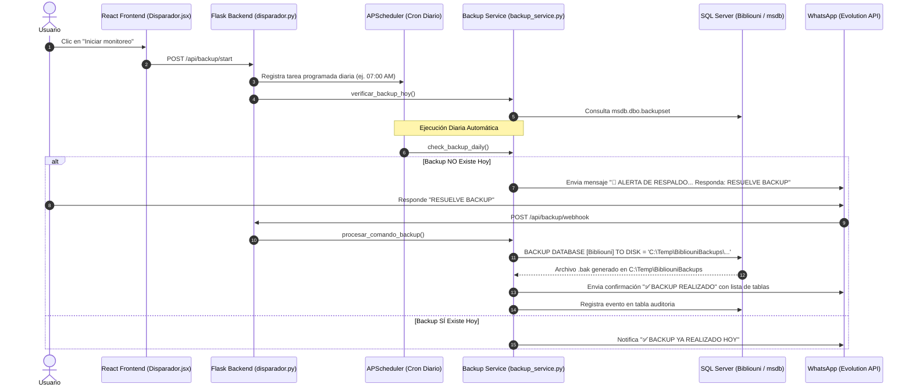

# 💾 Documentación del Sistema de Monitoreo y Backup

Este documento explica en detalle la arquitectura, ubicación del código y el funcionamiento paso a paso del módulo de **Backup y Monitoreo** en la aplicación.

---

## 📁 Ubicación del Código

La funcionalidad de backup se encuentra distribuida entre el **Frontend** (React) y el **Backend** (Flask + SQLAlchemy/pyodbc):

| Capa | Archivo | Responsabilidad / Descripción |
| :--- | :--- | :--- |
| **Frontend** | [`dashboard/frontend/src/components/Disparador.jsx`](file:///c:/Users/jeanm/Downloads/Software-Datos/dashboard/frontend/src/components/Disparador.jsx#L271-L302) | Interfaz gráfica. Captura el clic del botón **"Iniciar monitoreo"** y envía la petición HTTP a Flask. |
| **Rutas Backend** | [`dashboard/backend/routes/disparador.py`](file:///c:/Users/jeanm/Downloads/Software-Datos/dashboard/backend/routes/disparador.py#L432-L520) | Define los endpoints `/api/backup/start`, `/api/backup/stop`, `/api/backup/status` y el Webhook receptor de WhatsApp `/api/backup/webhook`. |
| **Servicio de Backup** | [`dashboard/backend/services/backup_service.py`](file:///c:/Users/jeanm/Downloads/Software-Datos/dashboard/backend/services/backup_service.py#L178-L245) | Contiene la lógica central de la base de datos: ejecuta la sentencia `BACKUP DATABASE`, verifica archivos físicos y consulta `msdb.dbo.backupset`. |
| **Configuración** | [`dashboard/backend/config/settings.py`](file:///c:/Users/jeanm/Downloads/Software-Datos/dashboard/backend/config/settings.py) y [`dashboard/backend/.env`](file:///c:/Users/jeanm/Downloads/Software-Datos/dashboard/backend/.env) | Define variables como `BACKUP_PATH` (`C:\Temp\BibliouniBackups`), número de WhatsApp y horarios. |
| **Envío WhatsApp** | [`dashboard/backend/whatsapp.py`](file:///c:/Users/jeanm/Downloads/Software-Datos/dashboard/backend/whatsapp.py) | Envía mensajes de alerta y confirmación utilizando Evolution API. |

---

## 👆 1. ¿Qué sucede al hacer clic en el botón "Iniciar Monitoreo"?

Cuando presionas el botón **"Iniciar monitoreo"** en la interfaz del módulo *Disparador*:

1. **Captura del evento en Frontend**:
   - En [`Disparador.jsx`](file:///c:/Users/jeanm/Downloads/Software-Datos/dashboard/frontend/src/components/Disparador.jsx#L271-L302), se ejecuta la función `handleBackupStart()`.
   - Esta función lee el número de destino de WhatsApp, la hora y el minuto configurados en los inputs, y realiza un POST HTTP:
     ```javascript
     const res = await axios.post("/api/backup/start", {
       number: backupPhone.trim(),
       hour: parseInt(backupHour, 10),
       minute: parseInt(backupMinute, 10),
     });
     ```

2. **Recepción en Backend**:
   - En [`routes/disparador.py`](file:///c:/Users/jeanm/Downloads/Software-Datos/dashboard/backend/routes/disparador.py#L432), la función `start_backup_scheduler()` atiende la petición `/api/backup/start`.
   - Configura el webhook de Evolution API y registra una tarea programada (*CronJob*) en **APScheduler** para ejecutarse diariamente a la hora configurada (ej. `07:00` o `13:50` America/Lima).

3. **Verificación Inmediata del Backup del Día**:
   - Inmediatamente al iniciar el monitoreo, la API ejecuta `verificar_backup_hoy()` ([`backup_service.py`](file:///c:/Users/jeanm/Downloads/Software-Datos/dashboard/backend/services/backup_service.py#L64-L135)).
   - Si se detecta que **ya existe** un backup del día en el disco local:
     - Se envía una notificación por WhatsApp informando la hora del backup y la ruta del archivo.
     - Se registra el evento en la tabla de **Auditoría**.

---

## ⚙️ 2. ¿Cómo se realiza el Backup de la Base de Datos?

### ¿Se usa un script externo o una API/T-SQL?
**No se utiliza un script externo (.bat o .ps1).** El backup se ejecuta mediante la librería nativa de Python `pyodbc` que envía un comando **T-SQL nativo directamente a SQL Server**.

El código responsable está en la función `ejecutar_backup()` en [`backup_service.py`](file:///c:/Users/jeanm/Downloads/Software-Datos/dashboard/backend/services/backup_service.py#L178-L245):

```python
def ejecutar_backup():
    # 1. Asegurar directorio de almacenamiento
    os.makedirs(BACKUP_PATH, exist_ok=True)

    # 2. Generar nombre con timestamp
    timestamp = datetime.now().strftime('%Y%m%d_%H%M%S')
    nombre_archivo = f"Bibliouni_{timestamp}.bak"
    ruta_completa = os.path.join(BACKUP_PATH, nombre_archivo)
    ruta_sql = ruta_completa.replace('\\', '\\\\')

    # 3. Sentencia T-SQL Nativa
    sql = f"""
    BACKUP DATABASE [{Config.BIBLIOUNI_DB}] 
    TO DISK = N'{ruta_sql}' 
    WITH FORMAT, COMPRESSION, STATS=10;
    """

    # 4. Conectar a SQL Server (BD master) y ejecutar
    conn_str = _get_bibliouni_connection_string()
    with pyodbc.connect(conn_str, timeout=120, autocommit=True) as conn:
        cursor = conn.cursor()
        cursor.execute(sql)
```

---

## 📁 3. ¿Cómo se conecta con la carpeta Temp del Almacenamiento?

1. **Ruta Configurada**:
   - En el archivo [`.env`](file:///c:/Users/jeanm/Downloads/Software-Datos/dashboard/backend/.env) se define la variable `BACKUP_PATH=C:\Temp\BibliouniBackups`.
   - En `backup_service.py`, la constante `BACKUP_PATH` lee este valor del entorno (o usa `C:\Temp\BibliouniBackups` por defecto).

2. **Creación Automática de la Carpeta**:
   - Antes de ejecutar la sentencia SQL, Python llama a `os.makedirs(BACKUP_PATH, exist_ok=True)`. Esto asegura que si la carpeta `C:\Temp\BibliouniBackups` no existe en Windows, se cree automáticamente.

3. **Escritura Directa por el Motor de SQL Server**:
   - El comando `BACKUP DATABASE [Bibliouni] TO DISK = N'C:\Temp\BibliouniBackups\Bibliouni_YYYYMMDD_HHMMSS.bak'` le da la orden directa al servicio de SQL Server para escribir el archivo comprimido `.bak` en esa carpeta local del disco duro.

4. **Verificación Posterior**:
   - Una vez finalizada la consulta SQL, Python verifica la existencia física y tamaño del archivo generado usando `os.path.exists(ruta_completa)` y `os.path.getsize(ruta_completa)`.

---

## 🔄 4. Flujo Completo Automático y por WhatsApp



---

## 📄 Resumen de Endpoints API Relacionados

- **`POST /api/backup/start`**: Inicia el monitoreo y programa la verificación diaria en APScheduler.
- **`GET /api/backup/stop`**: Detiene el monitoreo y cancela el CronJob.
- **`GET /api/backup/status`**: Retorna si el monitoreo está activo, la próxima ejecución y el estado actual.
- **`POST /api/backup/webhook`**: Recibe mensajes entrantes de WhatsApp desde Evolution API para procesar el comando `RESUELVE BACKUP`.
- **`GET /api/backup/test-alert`**: Permite probar el envío inmediato de la alerta por WhatsApp sin esperar al horario programado.
- **`GET /api/backup/test-check`**: Ejecuta la verificación manualmente para fines de prueba y diagnóstico.
